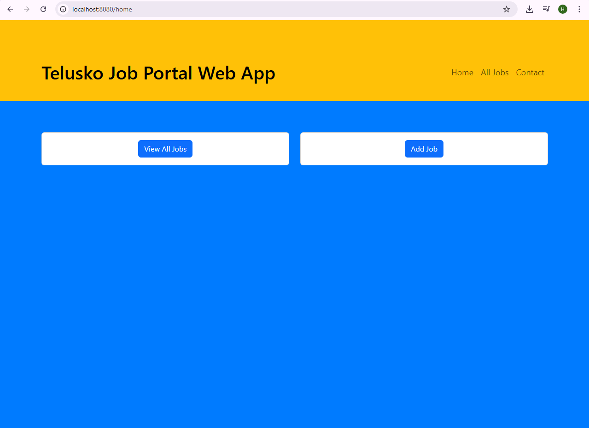
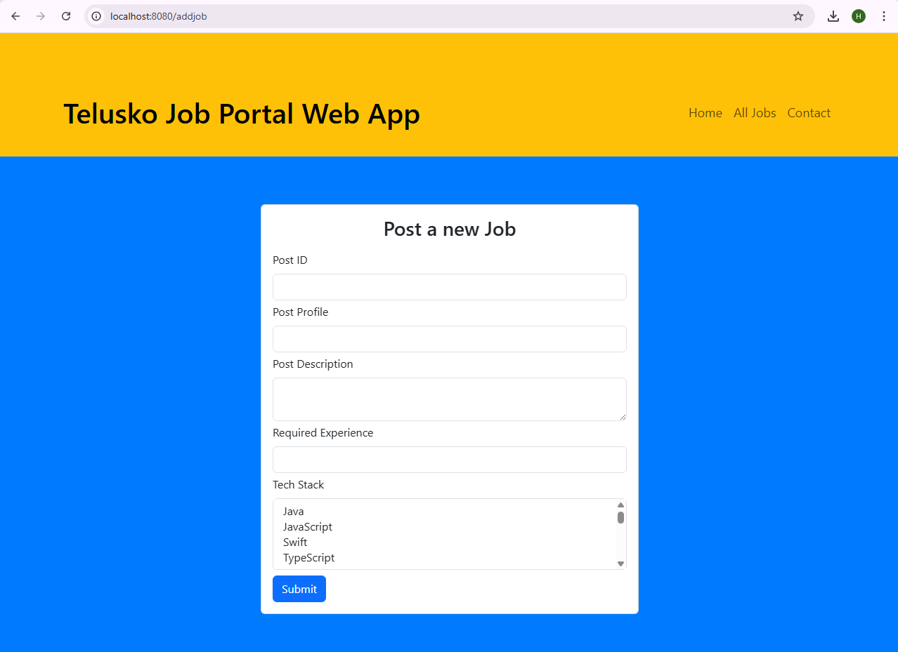
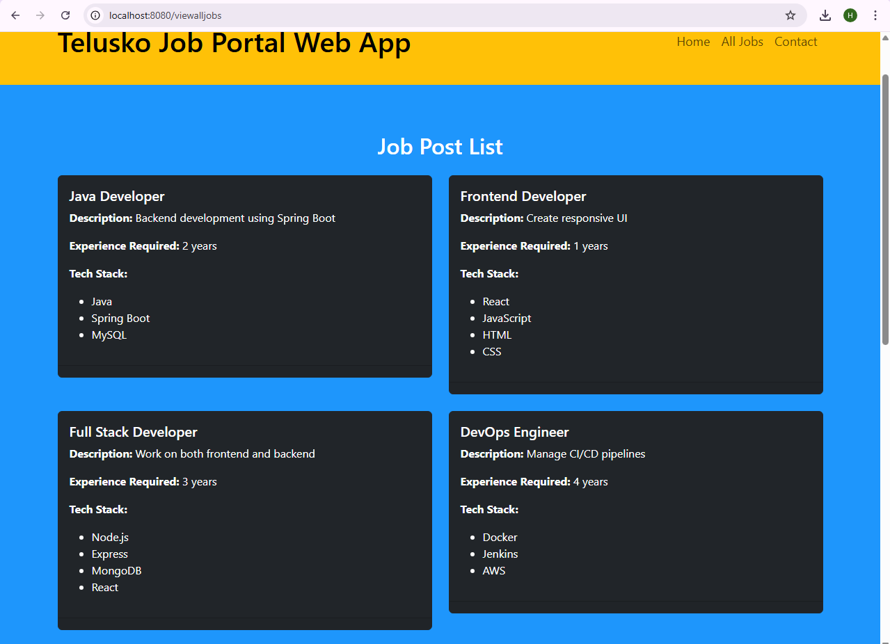

# 🧑‍💼 Job Posting Web App

A simple Spring Boot-based Job Posting Web Application to demonstrate form handling, MVC architecture, and dynamic data rendering using JSP.

## 🚀 Project Overview

This project is built as part of the "Building a Job Web App" section in a Spring Boot course. It enables users to add and view job postings using a layered architecture (Controller, Service, Model).

### 🎯 Features

- Homepage and job submission page
- Form handling using Spring Boot model binding
- View all posted jobs dynamically
- Separation of concerns using MVC pattern
- Sample dummy data for demonstration

## 🏗️ Tech Stack

- Java 17+
- Spring Boot
- JSP (Java Server Pages)
- Maven
- Embedded Tomcat Server

## 📂 Project Structure

```
├── src
│   ├── main
│   │   ├── java
│   │   │   └── com.learning.JobApp
│   │   │       ├── controller
│   │   │       │   └── JobController.java
│   │   │       ├── model
│   │   │       │   └── JobPost.java
│   │   │       └── service
│   │   │           └── JobService.java
│   │   └── resources
│   │       ├── templates
│   │       │   ├── home.jsp
│   │       │   ├── addjob.jsp
│   │       │   └── success.jsp
│   │       └── application.properties
└── pom.xml
```

## 🧪 Sample Dummy Data

```java
new JobPost(1, "Java Developer", "Looking for core Java dev", 3, new String[]{"Java", "Spring"});
new JobPost(2, "Frontend Engineer", "React + Bootstrap expert", 2, new String[]{"React", "Bootstrap"});
// ... up to 10 entries
```

## 📝 Screenshots

| Home Page | Add Job | Job Listings |
|-----------|---------|--------------|
|  |  |  |

## 🌐 Connect

If you're learning backend development or building Spring Boot projects, feel free to connect with me on [LinkedIn](https://www.linkedin.com/in/mohan-lal-b79790126/).

---

> Built with ❤️ using Spring Boot to reinforce MVC and data flow concepts.